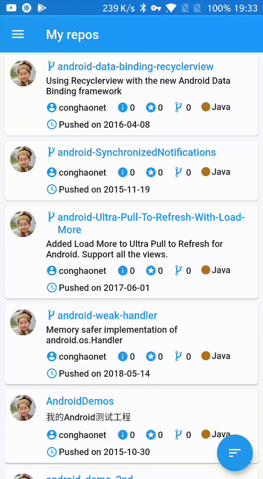
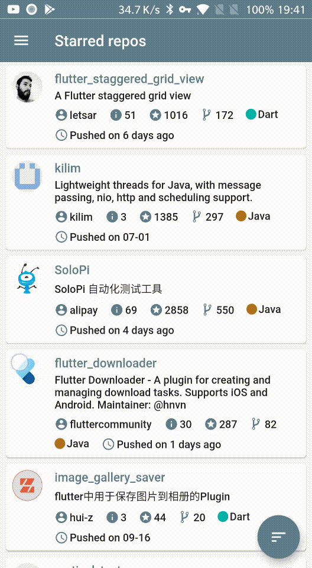

# GitHao

Android and iOS open-source GitHub Flutter client app

## Getting Started

This project is a starting point for a Flutter application.

A few resources to get you started if this is your first Flutter project:

- [Lab: Write your first Flutter app](https://flutter.dev/docs/get-started/codelab)
- [Cookbook: Useful Flutter samples](https://flutter.dev/docs/cookbook)

For help getting started with Flutter, view our
[online documentation](https://flutter.dev/docs), which offers tutorials,
samples, guidance on mobile development, and a full API reference.

## Development environment and tool chain
* Flutter version v1.9.1+hotfix.6
* Framework revision 68587a0916, 2019-09-13 19:46:58 -0700
* Engine revision b863200c37
* Dart version 2.5.0
* Android Studio (version 3.5)
  - Java version OpenJDK Runtime Environment (build 1.8.0_202-release-1483-b03)
  - Flutter plugin version 41.0.2
  - Dart plugin version 191.8593
  - [Flutter i18n plugin](https://github.com/long1eu/flutter_i18n)
* Develop for Android
  - Platform android-29, build-tools 29.0.2
  - Kotlin version 1.3.50
* Develop for iOS and macOS
  - Xcode 11.2
  - CocoaPods version 1.8.4

## Screenshots
  
 
  
  
  

## Thanks for open source
* [OpenHub](https://github.com/ThirtyDegreesRay/OpenHub) An open source GitHub Android client app, faster and concise.
* [fluttertoast](https://github.com/PonnamKarthik/FlutterToast) Android and iOS Toast Library for Flutter.
* [flutter/plugins](https://github.com/flutter/plugins)
  - [shared_preferences](https://github.com/flutter/plugins/tree/master/packages/shared_preferences) Wraps NSUserDefaults (on iOS) and SharedPreferences (on Android), providing a persistent store for simple data.
  - [webview_flutter](https://github.com/flutter/plugins/tree/master/packages/webview_flutter) A Flutter plugin that provides a WebView widget.
  - [connectivity](https://github.com/flutter/plugins/tree/master/packages/connectivity) This plugin allows Flutter apps to discover network connectivity and configure themselves accordingly.
* [json_serializable, json_annotation](https://github.com/dart-lang/json_serializable) Provides source_gen Generators to create code for JSON serialization and deserialization.
* [dio](https://github.com/flutterchina/dio) A powerful Http client for Dart, which supports Interceptors, FormData, Request Cancellation, File Downloading, Timeout etc.
* [intl](https://github.com/dart-lang/intl) Internationalization and localization support.
* [provide](https://github.com/google/flutter-provide) A simple framework for state management in Flutter.
* [flutter_cached_network_image](https://github.com/renefloor/flutter_cached_network_image) Download, cache and show images in a flutter app.
* [dart-event-bus](https://github.com/marcojakob/dart-event-bus) An Event Bus using Dart Streams for decoupling applications.
* [flutter_syntax_view](https://github.com/BaderEddineOuaich/flutter_syntax_view) A SyntaxView Widget which highlights code text according to the programming language syntax.
* [flutter_statusbarcolor](https://github.com/mchome/flutter_statusbarcolor) A package can help you to change your flutter app's statusbar's color or navigationbar's color programmatically.
* [build_runner](https://github.com/dart-lang/build) A build system for Dart.
