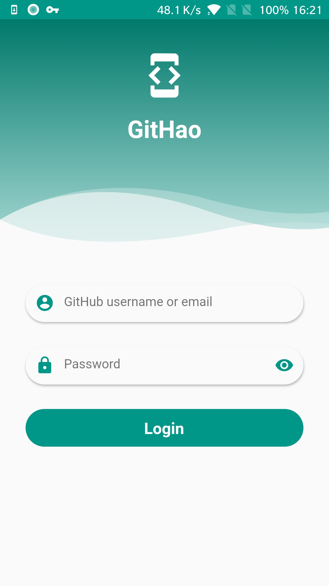
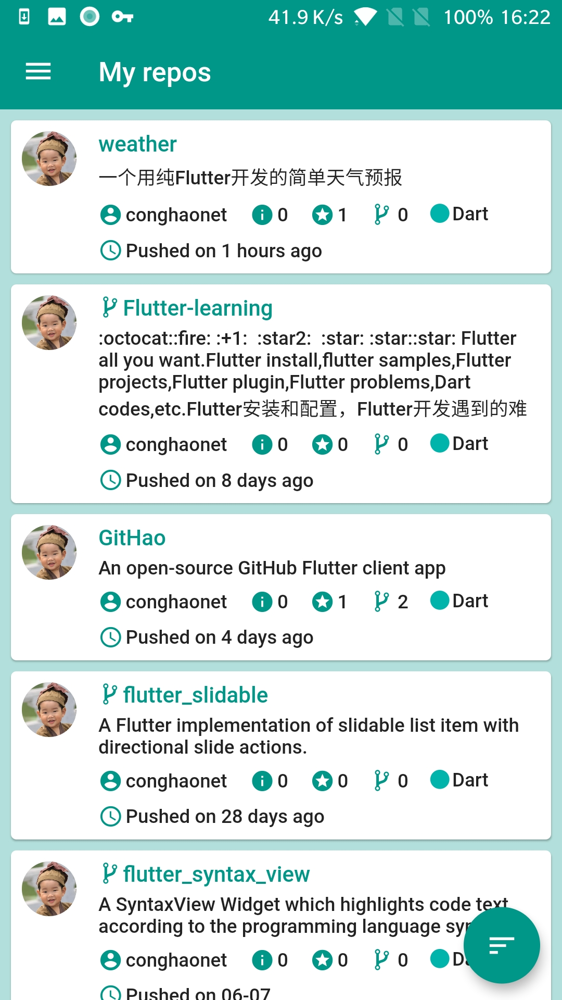
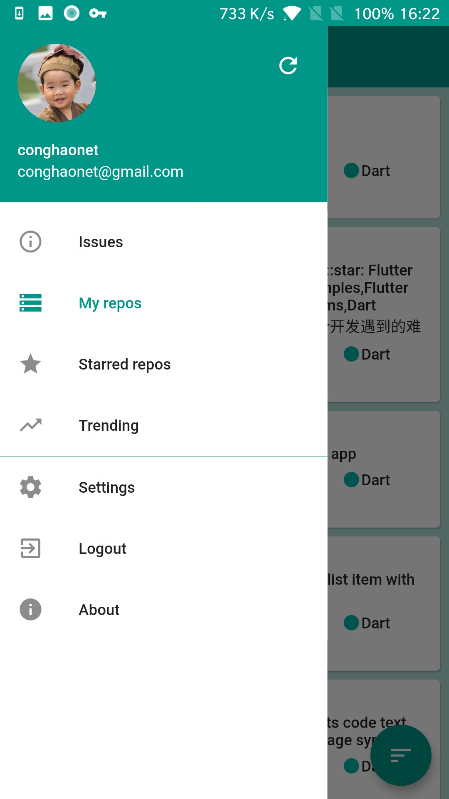
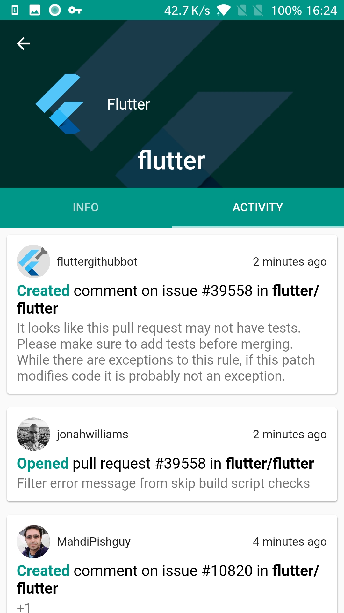
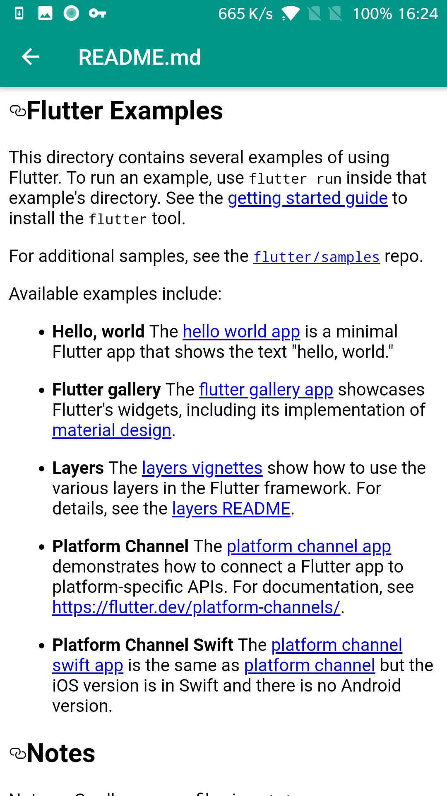
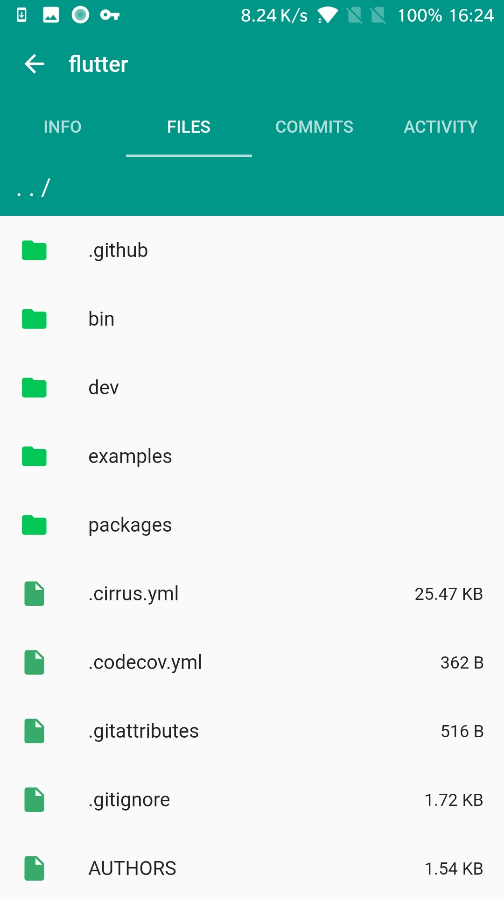
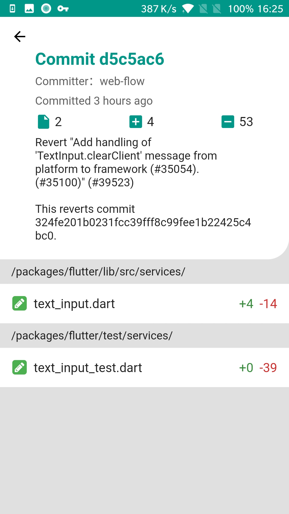
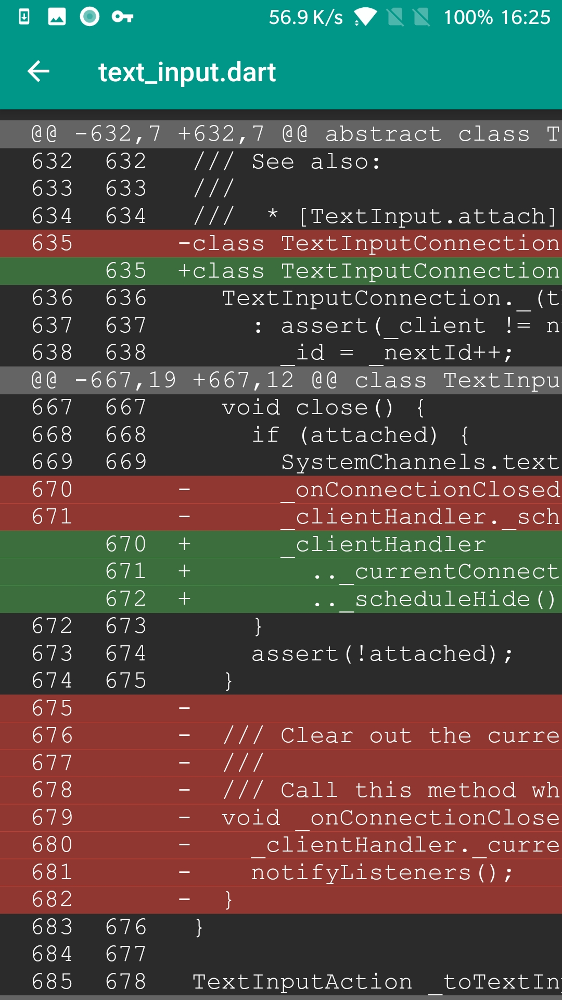
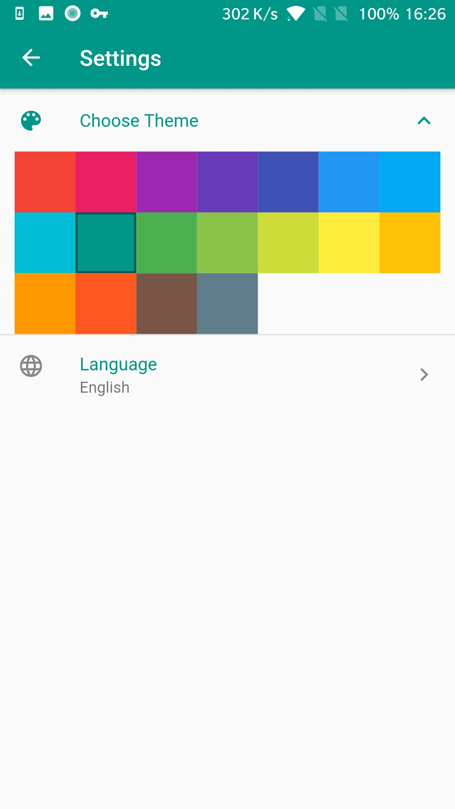

# GitHao

An open-source GitHub Flutter client app

## Getting Started

This project is a starting point for a Flutter application.

A few resources to get you started if this is your first Flutter project:

- [Lab: Write your first Flutter app](https://flutter.dev/docs/get-started/codelab)
- [Cookbook: Useful Flutter samples](https://flutter.dev/docs/cookbook)

For help getting started with Flutter, view our
[online documentation](https://flutter.dev/docs), which offers tutorials,
samples, guidance on mobile development, and a full API reference.

## Development environment and tool chain
* Flutter version 1.9.1+hotfix.2
* Dart version 2.5.0
* Java version OpenJDK Runtime Environment (build 1.8.0_202-release-1483-b03)
* Android Studio (version 3.5)
  - Android Studio plugins：
    [Flutter i18n](https://github.com/long1eu/flutter_i18n)

## Screenshots
  
  
  

